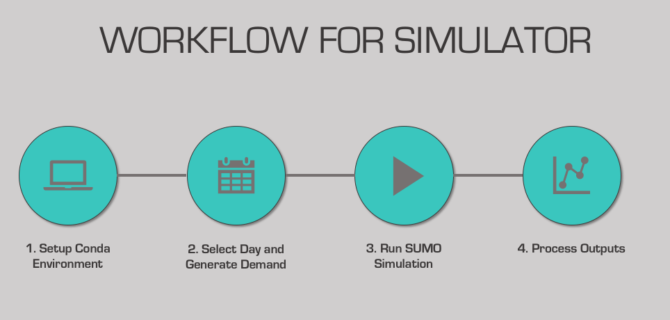

# ATHENA MODELING: SIMULATION WITH SUMO
### Contributors: 
Juliette Ugirumurera <Juliette.Ugirumurera@nrel.gov>.
 
& Joseph Severino: <Joseph.Severino@nrel.gov>

## THIS IS A CONFIG/ANALYSIS REPO

### The following are contained in this repository

File System for ATHENA

+	SUMO
    - SUMO_input_data
       * List of files
            - list of Newtwork files:
                1. Bus_Aug-15-19.xml
                2. Bus_routes.xml
                3. trip_2017-12-31.xml
                4. trip_2018-06-11.xml
                5. trip_Policy.xml
                6. trip_custom.xml
            - list of Network Files:
                1. DFW_valid_2.net.xml
            - list of additional files:
                1. additional_2018-06-11.xml
            - [README.md](https://github.com/NREL/ATHENA-siem-sumo/tree/master/Sumo/SUMO_input_data)
    - Simulations
       * OutputData: individual trip data to include emissions
            - list of output files:
                1. stop_output_high.csv
                2. stop_output_low.csv
                3. stop_output_med.csv
                4. trip_output_high.csv
                5. trip_output_low.csv
                6. trip_output_med.csv
       * List of ipynb notebooks:
            1. DFW_gen_flow.ipynb (code to generate demand file)
            2. Output_for_objective_function.ipynb (code to generate output metrics for objective model)
       * List of files
            1. athena_sumo_v1.csv (demand prediction per hour per terminal)
       * [README.md](https://github.com/NREL/ATHENA-siem-sumo/tree/master/Sumo/Simulations)
    - [README.md](https://github.com/NREL/ATHENA-siem-sumo/tree/master/Sumo)
    - Environment.yml
+	.gitignore
+	README.md

## HOW TO USE THIS REPO

### 1. Setup Conda Environment
use this [README.md](https://github.com/NREL/ATHENA-siem-sumo/tree/master/Sumo) for instructions
    
### 2. Select day and generate Demand
use  this [README.md](https://github.com/NREL/ATHENA-siem-sumo/tree/master/Sumo/Simulations) Section 1 for
instructions 
### 3. Run SUMO simulation
use this [README.md](https://github.com/NREL/ATHENA-siem-sumo/tree/master/Sumo/SUMO_input_data)
### 4. Process Outputs 
use  this [README.md](https://github.com/NREL/ATHENA-siem-sumo/tree/master/Sumo/Simulations) Section 2 for  
instructions 
