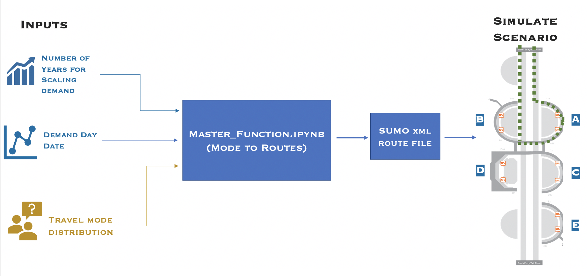

# ATHENA MODELING: SIMULATION WITH SUMO
### Contributors:
Juliette Ugirumurera <Juliette.Ugirumurera@nrel.gov>.
<br>
 Joseph Severino: <Joseph.Severino@nrel.gov>
<br>
Monte Lunacek: <Monte.Lunacek@nrel.gov>
<br>
Yanbo Ge: <Yanbo.Ge@nrel.gov>

## THIS IS A CONFIG/ANALYSIS REPO
### Description of REPO
<p>This repo is a container for all the code related to modeling DFW airport curbside (CTA modeling) using SUMO simulator and the pipeline into the infrustructure optimization model. It demonstrates how to install, run and derive useful data from SUMO simulations. We will describe the basic files needed to run a simulation and how those files are generated.The repository also has code for generating simulations representing different congestion policies and how to run those simulation on NREL's Eagle supercomputer. The examples provided are a representation of the DFW airport for curbside dropoff and and pickup.</p>

### The following are contained in this repository

File System for ATHENA SUMO


- Install_SUMO
 
```html
if SUMO is not installed please refer to the link below for installation
```
      * MAC users: [SUMO for MACs](https://sumo.dlr.de/docs/Installing/MacOS_Build.html)
      * If you have access to NREL GitHub use this [MAC install](https://github.nrel.gov/jseverin/Sumo/blob/master/README.md)
      * Windows users: [SUMO for Windows](http://sumo.dlr.de/docs/Installing.html)

     
- Generate_SUMO_demand
     * [README.md](https://github.com/NREL/ATHENA-siem-sumo/tree/master/Generate_SUMO_demand)
     * environment.yml
     * Ipython notebook
- Process_SUMO_outputs
     * [README.md](https://github.com/NREL/ATHENA-siem-sumo/tree/master/Process_SUMO_output)
     * Ipython notebook

- Congestion_Policies
     * [README.md](https://github.com/NREL/ATHENA-sumo/tree/master/Congestion_Policies)
     * Simulate_on_Eagle folder with instructions on how to simulate on [Eagle Supercomputer](https://www.nrel.gov/hpc/eagle-system.html).
     * Master_Function.ipynb: main notebook for generating simulations for different congestion policies
     * Ipython notebooks used by the Master_Function.ipynb notebooks
     * Ipython notebooks to test the functionality of Master_Function.ipynb
- Simulate_on_Eagle:
     * [README.md](https://github.com/NREL/ATHENA-sumo/tree/master/Congestion_Policies)
     * Create_Script.ipynb Ipython notebook for creating batch script files for running SUMO simulations on Eagle supercomputer
     * Create_Script*.py python scripts to create batch files for running SUMO simulations on Eagle
     * generateEdges*.py scripts to create SUMO xml files to get outputs from SUMO simulations
- Example_Files
     * Prediction File
     * Folder w/ Sample Inputs
     * Folder w/ Sample OUTPUTS
-	.gitignore
-	README.md

## HOW TO USE THIS REPO - GENERATE A SUMO SIMULATION


### 1. Setup Conda Environment
> use this [README.md](https://github.com/NREL/ATHENA-siem-sumo/tree/master/Generate_SUMO_demand)  for instructions

### 2. Select day and generate Demand
> use  this [README.md](https://github.com/NREL/ATHENA-siem-sumo/tree/master/Generate_SUMO_demand) for
instructions
### 3. Run SUMO simulation
> use this [README.md](https://github.com/NREL/ATHENA-siem-sumo/tree/master/Process_SUMO_output)
### 4. Process Outputs
> use  this [README.md](https://github.com/NREL/ATHENA-siem-sumo/tree/master/Process_SUMO_output) for  
instructions

## HOW TO USE THIS REPO - GENERATE A CONGESTION POLICY SIMULATION


### 1. Generate congestion policy sumo xml route file
> use this [README.md](https://github.com/NREL/ATHENA-sumo/tree/master/Congestion_Policies)  for 
instructions

### 2. Run simulation on Eagle. We suggest generating multiple route files with step 1 to run many simulations in parallel.
> use  this [README.md](https://github.com/NREL/ATHENA-sumo/tree/master/Congestion_Policies/Simulate_on_Eagle) for instructions

